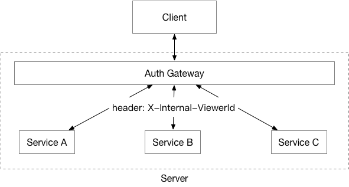

# Auth Gateway
A service that will handle auth issues.

[](https://travis-ci.org/isayme/auth-gateway)
[](https://coveralls.io/github/isayme/auth-gateway?branch=master)

## Usage


### Nginx Config Example
```
    location / {
        proxy_pass http://auth-gateway;
    }

    location @accel {
        internal;

        set $XViewerID $upstream_http_x_internal_viewerid;
        proxy_set_header X-Internal-ViewerID $XViewerID;

        proxy_pass https://httpbin.org;
    }
```
